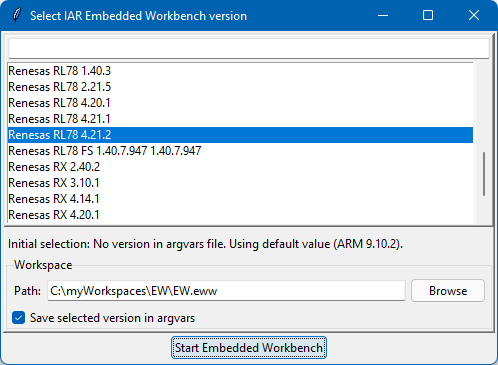

# EWlaunch

__EWlaunch__ lets you select the version of _IAR Embedded Workbench_ to use with any given workspace:



This is useful when you have multiple versions of _IAR Embedded Workbench_ installed, to work around the operating system's file extension association limitation. Once a version is selected, the choice can be stored in a corresponding `<workspace>.custom_argvars` file. When this option is used, the next time the workspace is launched, it will use the previously selected version.

Existing installations are automatically located from the _Windows Registry_. You can also manually specify installation directories.

If you end up with a question or suggestion specifically related to the [__EWlaunch utility__][url-repo-home], you might be interested in verifying if it was already discussed in [earlier issues][url-repo-issue-old]. If you could not find what you are looking for, feel free to [create a new issue][url-repo-issue-new].

It is possible to receive [notifications][url-gh-docs-notify] about updates in your GitHub inbox by starting to __watch__ this repository.

## Setup

Download and extract the latest [binary release][url-repo-latest-zip]. Check that `ewlaunch.exe` is among the extracted files, otherwise verify that you downloaded the [binary release][url-repo-latest-zip] rather than the source code.

There are two binaries in the __EWlaunch__ installation:
* `ewlaunch_win.exe` is typically used through file association and/or the Explorer context menu, as described in the following sections.
* `ewlaunch.exe` is a console application, see the section on _Command line usage_.


### Context Menu
To add __EWlaunch__ to the right-click context menu in Windows file explorer:
1. Edit `add_context_menu.reg` with the path to `ewlaunch.exe` (the default is `c:\ewlaunch\ewlaunch.exe`).
2. Run `add_context_menu.reg` to add the entries to the registry.

### File Type Association
To associate the file types `.eww` and/or `.custom_argvars`:
1. Shift + right-click on a file, of the type that you want to be opened by __EWlaunch__.
2. Select __Open With > Select Program ...__
3. Browse to locate `ewlaunch.exe`.
4. Select __Always use this program__.


## Usage

Below are some examples of how to perform common tasks using __EWlaunch__.
See also [ewlaunch.ini](ewlaunch.ini) for configuration options.

### Open an existing workspace (`.eww`) file

If file type associations have been configured, simply click on the file to open. Alternatively, open the context menu by right-clicking on the file (or on the containing folder) and select "EWlaunch".

__EWlaunch__ inspects the corresponding `.custom_argvars` file to discover which version to launch. If it does not find such information, then a selection dialog will be shown.

To always show the selection dialog even when the version is known, press the Shift key when right-clicking on the file/folder, and select "EWlaunch (select version)".

### Create a new workspace
Right-click on a folder (that does not contain a `.eww` file) and select "EWlaunch" in the context menu. A new empty workspace is created inside the directory and opened in the selected version.

### Launch without workspace
In the __EWLaunch__ selection dialog, specify an empty workspace path to start the selected version of _IAR Embedded Workbench_ with no opened workspace.

### Open a shell

Shift + Right-click on the `.eww` file (or the containing directory) and select "EWlaunch (shell)". This starts a customized `cmd.exe` shell:

* Working directory is set to the workspace directory.
* The `bin` folders of IAR Embedded Workbench are added to the `PATH` environment variable.
* A number of environment variables are added, similar to the _argument variables_ that are available from inside IAR Embedded Workbench.

## Command line usage

This section shows some examples of using `ewlaunch.exe` from the command line.

**Example**: Listing versions
```
> ewlaunch command 9.20
Arm 9.20.1
Arm 9.20.2
...
```

**Example**: Running a one-liner
```
> ewlaunch command 9.20.[24] -- iccarm --version
Arm 9.20.2:
IAR ANSI C/C++ Compiler V9.20.2.320/W64 for ARM
Arm 9.20.4:
IAR ANSI C/C++ Compiler V9.20.4.327/W64 for ARM
```

The environment that the command (`iccarm --version` in the example above) runs in, is similar to what is described in [Open a shell](#Open-a-shell).

## Installation files

You can create a file where you manually specify installation directories. This file can then be specified in `ewlaunch.ini`, or on the command line with `--installations <file>`. To load installations both from a file, and from registry, specify the option `--reg`.

Below is an example of an installations file. `EW_DIR` is the path to the root of the IAR Embedded Workbench installation:

```
[Arm 7.80.4]
  EW_DIR: C:\IAR Systems\Embedded Workbench ARM 7.80.4
```

There are additional commands for dealing with installation files:
* `ewlaunch dump` creates a file with the installations found in registry.
* `ewlaunch scan` scans directory trees for installations.


## Version history

- 2.0 - 2022-05-24 - shell and command function.
- 1.0 - 2020-11-01 - Initial version

<!-- Links -->
[url-repo-home]:         https://github.com/IARSystems/ewlaunch
[url-repo-issue-new]:    https://github.com/IARSystems/ewlaunch/issues/new
[url-repo-issue-old]:    https://github.com/IARSystems/ewlaunch/issues?q=is%3Aissue+is%3Aopen%7Cclosed
[url-repo-latest-zip]:   https://github.com/IARSystems/ewlaunch/releases/latest
[url-gh-docs-notify]:    https://docs.github.com/en/github/managing-subscriptions-and-notifications-on-github/setting-up-notifications/about-notifications
